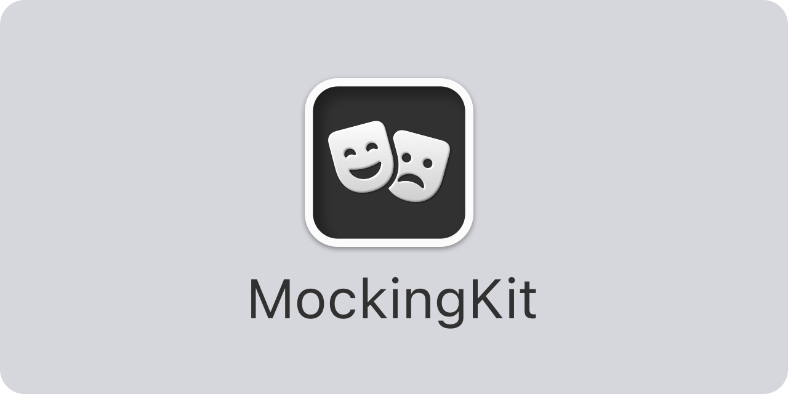

<p align="center">
    
</p>

<p align="center">
    
    
    
    
    
    
</p>


## About MockingKit

MockingKit is a `Swift` library that lets you mock protocols and classes, for instance when unit testing or mocking not yet implemented functionality.

MockingKit lets you create mock implementations of any protocol or mock sub classes any open base class, after which you can `call` functions, `register` function results and `inspect` all recorded calls.

MockingKit doesn't require any project configurations or build scripts, put any restrictions on your code or require you to structure it in any way. Just create a mock and you're good to go.


## Installation

MockingKit can be installed with the Swift Package Manager:

```
https://github.com/danielsaidi/MockingKit.git
```

or with CocoaPods:

```
pod MockingKit
```

If you prefer to not have external dependencies, you can also just copy the source code into your app.


## Supported Platforms

MockingKit supports `iOS 13`, `macOS 10.15`, `tvOS 13` and `watchOS 6`.


## Getting started

The [online documentation][Documentation] has a [getting started guide][Getting-Started] guide to help you get started with MockingKit.

In short, MockingKit lets you mock any protocols and open classes. For instance, consider this simple protocol:

```swift
protocol MyProtocol {

    func doStuff(int: Int, string: String) -> String
}
```

With MockingKit, you can easily create a mock implementation of this protocol: 

```swift
import MockingKit

class MyMock: Mock, MyProtocol {

    // You have to define a lazy reference for each function you want to mock
    lazy var doStuffRef = MockReference(doStuff)

    // Functions must then call the reference to be recorded
    func doStuff(int: Int, string: String) -> String {
        call(doStuffRef, args: (int, string))
    }
}
```

You can then use the mock to `register` function results, `call` functions and `inspect` recorded calls.

```swift
// Create a mock instance
let mock = MyMock()

// Register a result to be returned by doStuff
mock.registerResult(for: mock.doStuffRef) { args in String(args.1.reversed()) }

// Calling doStuff will now return the pre-registered result
let result = mock.doStuff(int: 42, string: "string") // => "gnirts"

// You can now inspect calls made to doStuff
let calls = mock.calls(to: \.doStuffRef)             // => 1 item
calls[0].arguments.0                                 // => 42
calls[0].arguments.1                                 // => "string"
calls[0].result                                      // => "gnirts"
mock.hasCalled(\.doStuffRef)                         // => true
mock.hasCalled(\.doStuffRef, numberOfTimes: 1)       // => true
mock.hasCalled(\.doStuffRef, numberOfTimes: 2)       // => false
```

For more information, please see the [online documentation][Documentation] and [getting started guide][Getting-Started].


## Documentation

The [online documentation][Documentation] has articles, code examples etc. that let you overview the various parts of the library. 


## Demo Application

The demo app lets you explore the library on iOS and macOS. To try it out, just open and run the `Demo` project.


## Support

You can sponsor this project on [GitHub Sponsors][Sponsors] or get in touch for paid support. 


## Contact

Feel free to reach out if you have questions or if you want to contribute in any way:

* Website: [danielsaidi.com][Website]
* Mastodon: [@danielsaidi@mastodon.social][Mastodon]
* Twitter: [@danielsaidi][Twitter]
* E-mail: [daniel.saidi@gmail.com][Email]


## License

MockingKit is available under the MIT license. See the [LICENSE][License] file for more info.


[Email]: mailto:daniel.saidi@gmail.com
[Website]: https://www.danielsaidi.com
[Twitter]: https://www.twitter.com/danielsaidi
[Mastodon]: https://mastodon.social/@danielsaidi
[Sponsors]: https://github.com/sponsors/danielsaidi

[Documentation]: https://danielsaidi.github.io/MockingKit/documentation/mockingkit/
[Getting-Started]: https://danielsaidi.github.io/MockingKit/documentation/mockingkit/getting-started
[License]: https://github.com/danielsaidi/MockingKit/blob/master/LICENSE
